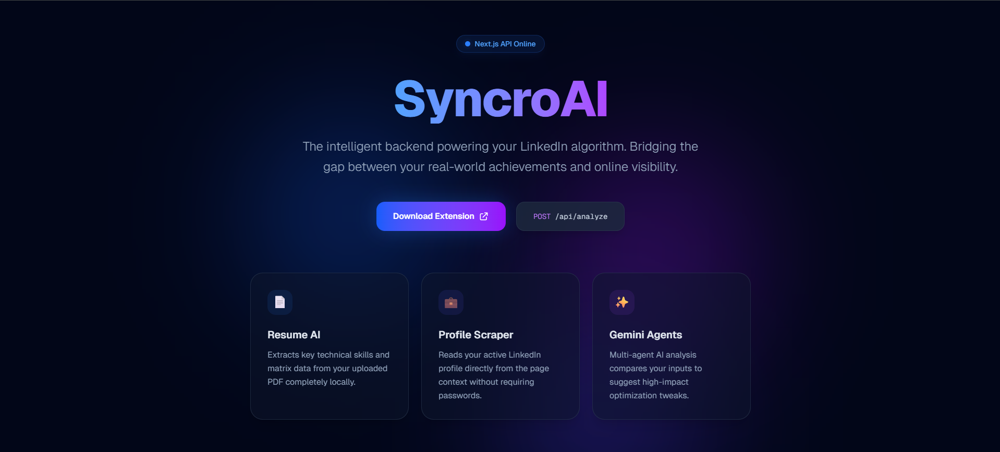
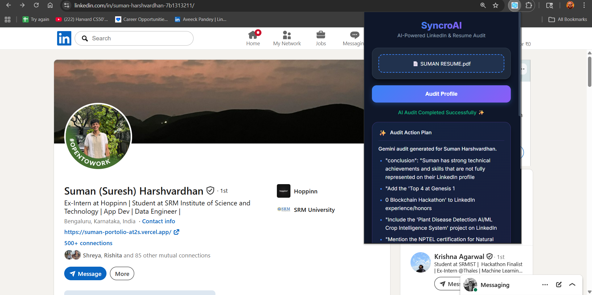
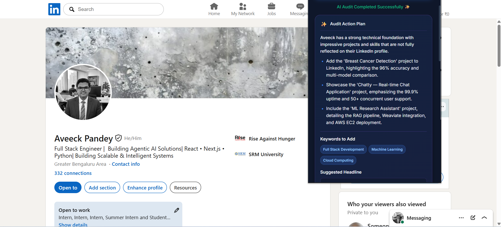
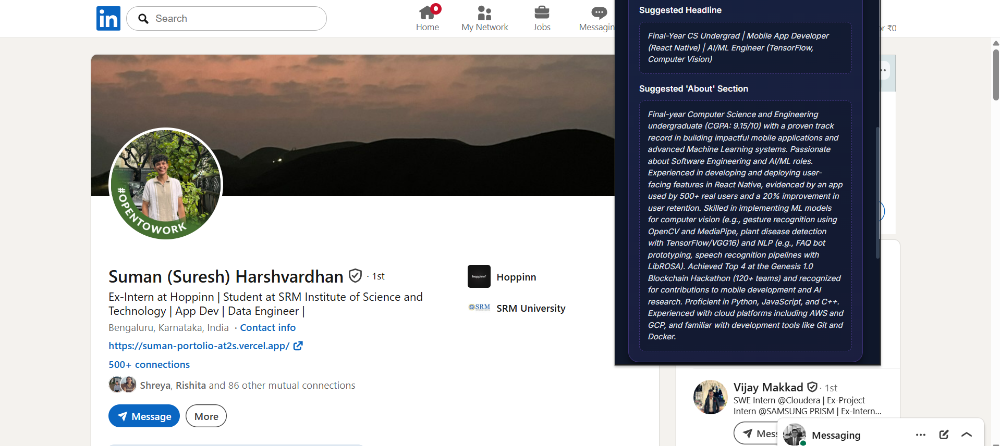
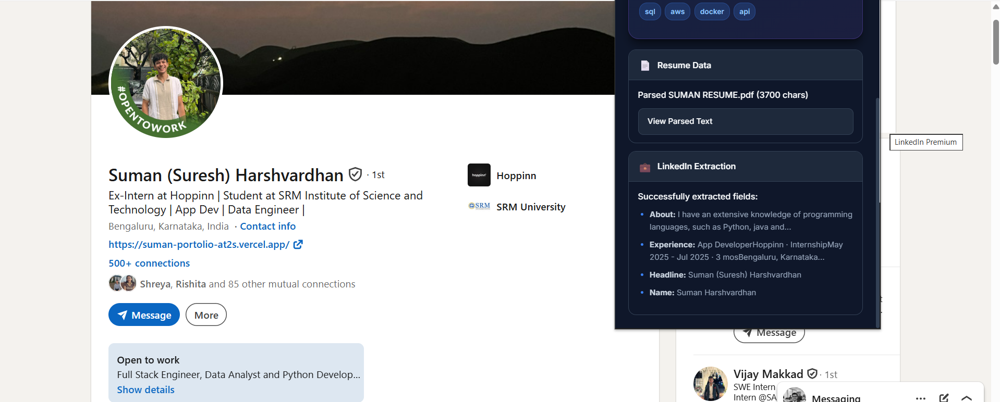

<div align="center">



# SyncroAI 🚀

### The Intelligent Backend Powering Your LinkedIn Algorithm

**Bridge the gap between your real-world achievements and your online visibility.**

[](https://nextjs.org/)
[](https://deepmind.google/technologies/gemini/)
[](https://chrome.google.com/webstore)
[](LICENSE)

</div>

---

## 📖 What is SyncroAI?

SyncroAI is a **Chrome Extension** powered by a **Multi-Agent AI system** that audits your LinkedIn profile against your resume — automatically. It identifies gaps, suggests high-impact keywords, rewrites your headline, and generates a full "About" section tailored to your actual experience.

Built for developers and students who want their digital presence to match the strength of their technical work.

---

## ✨ Features at a Glance

| Feature | Description |
|---|---|
| 📄 **Resume AI** | Extracts key technical skills and project data from your PDF locally |
| 🔍 **Profile Scraper** | Reads your active LinkedIn profile directly — no passwords required |
| 🤖 **Gemini Agents** | Multi-agent AI compares your inputs and suggests high-impact optimizations |
| 🏷️ **Keyword Generator** | Surfaces missing SEO keywords to boost LinkedIn discoverability |
| ✍️ **Headline Rewriter** | Crafts a high-converting professional headline based on your real skills |
| 📝 **About Section** | Generates a compelling, recruiter-ready bio from your resume data |

---

## 🖥️ Demo

### Extension in Action — Profile Upload & Audit

<div align="center">



*Upload your resume and hit Audit — SyncroAI handles the rest.*

</div>

### AI Audit Results — Action Plan

<div align="center">



*A targeted action plan pinpointing exactly what's missing from your LinkedIn profile.*

</div>

### Keyword Suggestions & Headline Rewrite

<div align="center">


*Context-aware keyword recommendations and a rewritten headline.*

</div>

### AI-Generated "About" Section

<div align="center">



*A full, recruiter-optimized About section drafted from your resume.*

</div>

### LinkedIn Extraction & Resume Parsing

<div align="center">



*Structured extraction of your LinkedIn profile data alongside parsed resume content.*

</div>
---

## 🤖 The Agentic Workflow

Unlike standard chatbots, SyncroAI employs **specialized AI personas** working in sequence:

```
┌─────────────────┐     ┌──────────────────┐     ┌──────────────────────┐
│  Fact Extractor  │────▶│   Gap Analyst     │────▶│   SEO Specialist     │
│                 │     │                  │     │                      │
│ Normalizes messy│     │ Diffs LinkedIn   │     │ Generates high-      │
│ PDF data into   │     │ text vs. Resume  │     │ converting headlines  │
│ structured JSON │     │ skills           │     │ & About sections     │
└─────────────────┘     └──────────────────┘     └──────────────────────┘
```

1. **The Fact Extractor** — Parses your resume PDF locally, normalizing raw text into structured JSON with skills, projects, and certifications.
2. **The Gap Analyst** — Performs a precise diff between your LinkedIn profile content and your resume data to surface what's missing.
3. **The SEO Specialist** — Generates recruiter-ready headlines, keyword lists, and "About" sections based on industry trends.

---

## 🛠️ Tech Stack

| Layer | Technology |
|---|---|
| **Extension** | JavaScript (Manifest V3), Chrome Scripting API |
| **Backend** | Next.js 15 (App Router), Node.js |
| **AI Brain** | Google Gemini 2.5 Flash-lite API |
| **PDF Processing** | `pdf-parse` — runs entirely locally |

---

## 🚀 Installation (Developer Mode)

### Prerequisites

- Node.js 18+
- A Google Gemini API key ([get one free](https://aistudio.google.com/))
- Google Chrome

### Steps

**1. Clone the repository**

```bash
git clone https://github.com/your-username/syncroai.git
cd syncroai
```

**2. Set up the backend**

```bash
cd backend
npm install
```

Create a `.env.local` file:

```env
GEMINI_API_KEY=your_gemini_api_key_here
```

Start the Next.js server:

```bash
npm run dev
```

The backend will be live at `http://localhost:3000`.

**3. Load the Chrome Extension**

1. Open Chrome and navigate to `chrome://extensions`
2. Toggle **Developer Mode** on (top right)
3. Click **Load Unpacked**
4. Select the `/extension` folder from this repo

**4. Use SyncroAI**

1. Navigate to any LinkedIn profile
2. Click the SyncroAI extension icon
3. *(Optional)* Upload your Resume PDF
4. Hit **Audit Profile** — your action plan will appear within seconds ✨

---

## 📡 API Reference

The backend exposes a single endpoint used by the extension:

```
POST /api/analyze
```

**Request Body:**

```json
{
  "linkedinData": {
    "name": "string",
    "headline": "string",
    "about": "string",
    "experience": "string"
  },
  "resumeText": "string (optional)"
}
```

**Response:**

```json
{
  "conclusion": "string",
  "actionItems": ["string"],
  "keywordsToAdd": ["string"],
  "suggestedHeadline": "string",
  "suggestedAbout": "string"
}
```

---

## 🗂️ Project Structure

```
syncroai/
├── extension/              # Chrome Extension (MV3)
│   ├── manifest.json
│   ├── popup.html
│   ├── popup.js
│   └── content.js          # LinkedIn profile scraper
├── backend/                # Next.js API
│   ├── app/
│   │   └── api/
│   │       └── analyze/
│   │           └── route.js
│   └── package.json
└── README.md
```

---

## 🤝 Contributing

Contributions, issues, and feature requests are welcome!

1. Fork the repository
2. Create your feature branch: `git checkout -b feature/amazing-feature`
3. Commit your changes: `git commit -m 'Add amazing feature'`
4. Push to the branch: `git push origin feature/amazing-feature`
5. Open a Pull Request

---

## 📄 License

This project is licensed under the MIT License — see the [LICENSE](LICENSE) file for details.

---

<div align="center">

Built with ❤️ to help developers present their best self online.

**[⭐ Star this repo](https://github.com/your-username/syncroai)** if SyncroAI helped you!

</div>
